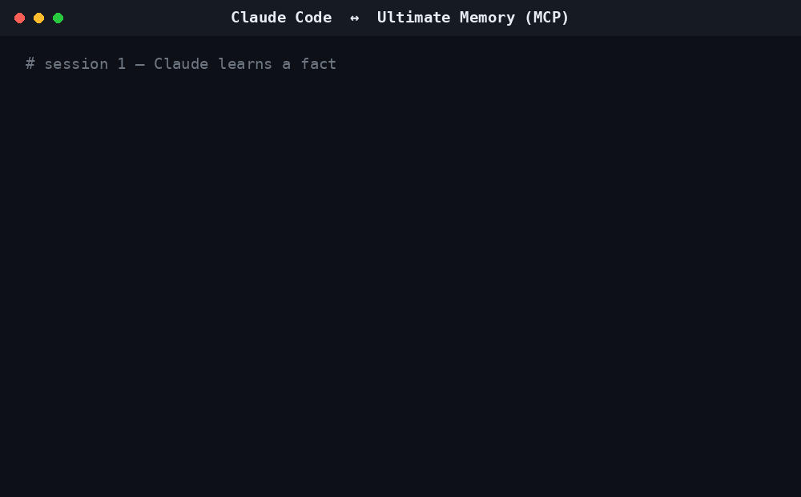

# Ultimate Memory

**Local-first, atomic, bi-temporal memory for Claude Code and Codex — via MCP.**

[](pyproject.toml)
[](https://modelcontextprotocol.io)
[](https://github.com/Cookie-Cat21/ultimate-memory/actions/workflows/tests.yml)
[](LICENSE)

Most agent memory tools give you a vector DB and call it a day: dump every message in, cosine-similarity it back out, and hope stale facts don't win. Ultimate Memory instead treats memory like a small knowledge base — **typed atomic facts** with **validity windows**, **auto-superseding contradictions**, **salience-ranked retrieval**, and a **human-readable Markdown vault** as the canonical source of truth. It runs entirely on your machine, speaks [MCP](https://modelcontextprotocol.io) to Claude Code and Codex, and degrades gracefully if Docker isn't running.



## Contents

- [Why](#why-this-can-beat-typical-agent-memory-stacks)
- [Benchmarks](#benchmarks)
- [Quick start](#quick-start)
- [MCP tools](#mcp-tools)
- [Client wiring](#client-wiring)
- [CLI](#cli-extras)
- [Docker router mode](#docker-router-mode)
- [Contributing](#contributing)

## Features

- **Atomic memories** — typed facts, decisions, preferences, and procedures (not just blob notes)
- **Bi-temporal validity** — `valid_from` / `valid_until` + `SUPERSEDES` so stale truth dies on contact
- **Contradiction-aware writes** — new atoms auto-invalidate conflicting older atoms
- **Salience ranking** — type importance × recency decay × reinforcement on access
- **Hybrid RRF retrieval** — Qdrant + SQLite FTS + vault markdown + atomic memory, fused then salience-reranked
- **Neo4j graph** — entities, atom `ABOUT` links, provenance, supersession
- **Private session logs** under `.ultimate-memory` (never dumped raw into your Obsidian vault)
- **Confidence gating** — low-signal reflections stage as candidates until promoted
- **Consolidation** — near-duplicate atom merge with dry-run safety
- **Chained multi-hop retrieval** — bridge-entity graph walk for multi-hop questions ("Elena's sister's employer's HQ city")
- Tiny dashboard for health, candidates, audit, and top atoms

## Why this can beat typical agent memory stacks

| Capability | Typical RAG / Mem0-style | Ultimate Memory |
|---|---|---|
| Human-readable canon | Often opaque DB rows | Obsidian / Basic Memory markdown |
| Memory unit | Chunks or free-form notes | Typed atomic memories |
| Stale facts | Accumulate | Bi-temporal + auto-supersede |
| Ranking | Similarity only | RRF + salience + type priors |
| Local / private | Often cloud | Local-first, Docker optional |
| Agent interface | SDK / REST | MCP tools for Claude + Codex |

## Benchmarks

Ultimate Memory now has two benchmark tracks:

- **Clean protocol (recommended):** raw dialogue only, automatic query planning, no gold
  category labels, no LoCoMo annotation summaries, and no benchmark-specific media/title
  hints. Run with `uv run python evals/run_clean_benchmarks.py --quick` or without
  `--quick` for the full suite.
- **Historical XL track:** retained in `evals/run_benchmarks.py` and
  `evals/RESULTS.md` for regression archaeology. Those historical numbers include
  benchmark-specific tuning and must not be presented as a clean state-of-the-art claim.

The clean harness reports answer token-F1 and evidence recall separately. Retrieval-only
metrics (Recall@K, reciprocal rank, nDCG@K) live in `evals/retrieval_metrics.py`.

The current production router no longer accepts benchmark categories as routing truth:
`memory_plan(question)` infers temporal intent, memory type, and hop depth directly from
the question.

### v1 architecture direction

- structured subject/predicate/object claims stored inside atomic-memory metadata
- semantic current-state conflict detection before lexical fallback heuristics
- automatic multi-hop planning
- project-scoped atomic and vector retrieval
- benchmark-integrity CI
- local-first fallback remains SQLite + FTS + Markdown; Qdrant/Neo4j stay optional
- frozen XL30 baseline: branch `archive/xl30-baseline`

See `docs/ARCHITECTURE_V1.md` for the invariants and clean-evaluation rules.

## Quick start

**Prerequisites:** Python 3.12–3.14, [`uv`](https://docs.astral.sh/uv/), Docker (optional — see fallback below).

```bash
git clone https://github.com/Cookie-Cat21/ultimate-memory.git
cd ultimate-memory
uv sync --extra dev
uv run ultimate-memory health
```

With Docker (adds Qdrant vector search + Neo4j graph memory):

```bash
docker compose up -d
uv run ultimate-memory index-vault
uv run ultimate-memory-router
```

Without Docker, the router still starts and falls back to Basic Memory + direct markdown search + SQLite FTS + atoms — you lose vector/graph retrieval, not the whole system.

## MCP tools

| Tool | Purpose |
|---|---|
| `memory_bootstrap(task, project_path?)` | Type-aware context packet (prefs/procedures first) |
| `memory_search(query, project_path?, memory_types?, limit?)` | Hybrid RRF + salience search |
| `memory_answer(question, project_path?, limit?, as_of?)` | Search + extractive QA answer, no LLM required |
| `memory_ingest_log(client, session_id, project_path?, transcript_or_path, tags?)` | Ingest a session transcript |
| `memory_reflect(source_refs, summary, facts, preferences, decisions, procedures, open_questions?)` | Distill a session into atomic memories |
| `memory_atoms(query?, memory_types?, project_path?, limit?, include_superseded?)` | List/query atoms directly |
| `memory_consolidate(dry_run?)` | Merge near-duplicate atoms (`dry_run=true` by default) |
| `memory_graph_query(entity_or_topic, depth?)` | Walk the Neo4j entity graph |
| `memory_promote(candidate_id)` | Promote a staged low-confidence candidate |
| `memory_supersede(old_ref, new_fact, reason, source_refs)` | Explicitly invalidate an old fact |

## Client wiring

Point your MCP client at the router, e.g. in `.mcp.json` or your client's config:

```bash
uv run --project /path/to/ultimate-memory ultimate-memory-router
```

Claude Code and Codex should call `memory_bootstrap` at session start, `memory_search` / `memory_atoms` as needed during the session, and `memory_reflect` at session end.

On Windows, Claude Code can also wire a `SessionEnd` hook to `scripts/ingest-claude-session.ps1`, which ingests the full transcript path into the private local log store (and auto-reflects when high-signal phrases are present).

## CLI extras

```bash
uv run ultimate-memory atoms --query "redis"
uv run ultimate-memory consolidate --dry-run
uv run ultimate-memory consolidate --no-dry-run
```

## Docker router mode

For service-style clients that can't spawn a stdio subprocess directly:

```bash
docker compose --profile router up -d
```

The streamable HTTP MCP endpoint is `http://127.0.0.1:8788/mcp`.

Set `ULTIMATE_MEMORY_VAULT_PATH` (see `.env.example`) to point the `/vault` mount at your actual Basic Memory / Obsidian vault; it defaults to `./vault` if unset.

## Contributing

Issues and PRs welcome. CI runs `ruff check` and the non-live test suite on every PR. Run `uv run pytest tests/ -k "not Live"` and `uv run ruff check .` before submitting, and if you touch retrieval/ranking behavior, run the relevant `evals/run_benchmarks.py` suite and log the before/after in `evals/RESULTS.md` — that log is what keeps regressions honest.

## License

[MIT](LICENSE)
